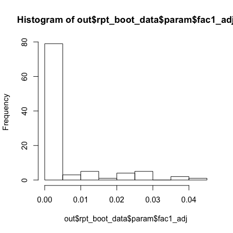
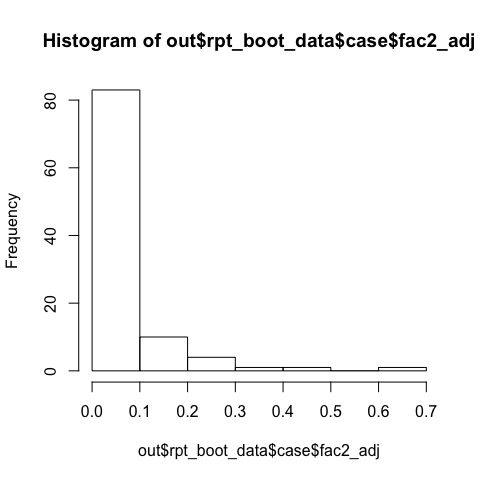
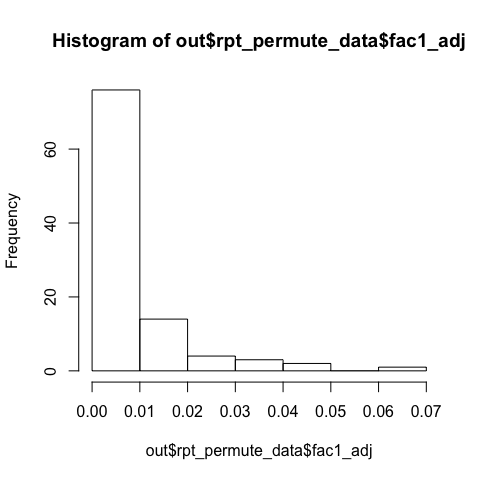

# rptGam

## Overview

**rptGam** is a package in R that estimates the repeatabilities of one
or more random rerms in generalized additive models (GAM), and
specifically gam and bam models from
[mgcv](https://cran.r-project.org/web/packages/mgcv/index.html).
**rptGam** was inspired by, and has similar functionality to,
[rptR](https://cran.r-project.org/web/packages/rptR/index.html), which
calculates repeatabilities from
[lme4](https://cran.r-project.org/web/packages/lme4/index.html) linear
mixed-effects models. See rptR’s
[vignette](https://cran.r-project.org/web/packages/rptR/vignettes/rptR.html)
and
[paper](http://onlinelibrary.wiley.com/doi/10.1111/2041-210X.12797/full)
for an overview og repeatabilities.

Notes: \* **rptGam** currenly supports only Gaussian models \* rptgam
accepts any valid mgcv model containing at least one random term.
Interactions are allowed as long as none of the random terms interact
with any other term (which would invalidate the random terms’
repatability estimate)

## Installation

``` r
# To install the latest version from Github:
# install.packages("devtools")
devtools::install_github("elipickh/rptGam")
```

## Usage

``` r
library(rptGam)

# Simulate data with one continuous predictor, one factor predictor and two grouped (factor) predictors
set.seed(1)
df <- mgcv::gamSim(1, n = 200, scale = 2, verbose = FALSE)[, 1:2]
fac1 <- sample(1:3, 200, replace=TRUE)
fac2 <- sample(1:5, 200, replace=TRUE)
b <- rnorm(20) * .5
df$x1 <- sample(1:4, 200, replace = TRUE)
df$y <- df$y + b[fac1] + b[fac2] + df$x1
df$fac1 <- as.factor(fac1)
df$fac2 <- as.factor(fac2)
df$x1 <- as.factor(df$x1)

str(df)
```

    ## 'data.frame':    200 obs. of  5 variables:
    ##  $ y   : num  13.73 18.38 4.87 3.68 4.6 ...
    ##  $ x0  : num  0.266 0.372 0.573 0.908 0.202 ...
    ##  $ x1  : Factor w/ 4 levels "1","2","3","4": 4 4 2 3 4 4 3 4 4 2 ...
    ##  $ fac1: Factor w/ 3 levels "1","2","3": 1 3 1 2 3 3 2 2 2 3 ...
    ##  $ fac2: Factor w/ 5 levels "1","2","3","4",..: 5 1 4 4 2 5 2 3 1 1 ...

The *rptgam* function can take as input either a model output from
mgcv::gam (or mgcv::bam) or a GAM formula. If using the latter option,
set either *gam\_pars* or *bam\_pars* to TRUE (to run a gam or a bam
model, respectively). Alternatively, *gam\_pars*/*bam\_pars* can be a
list of argumetns which will be passed to mgcv when running the model.

``` r
# Option 1: Create a model in mgcv and pass it to rptgam
mod <- mgcv::gam(y ~ x1 + s(x0) + s(fac1, bs = "re") + s(fac2, bs = "re"), 
                 data = df, method = "REML")
out <- rptgam(gamObj = mod)
```

    ## 
    ## Setting up parallel processing (4 cores, PSOCK)...done
    ## 
    ## Calculating AICs...done (0.07sec)
    ## 
    ## Running "select = TRUE" model...done (0.04sec)
    ## 
    ## Total run time: 2.74 sec

``` r
# Option 2: run the model in rptgam
out <- rptgam(formula = y ~ x1 + s(x0) + s(fac1, bs = "re") + s(fac2, bs = "re"), 
              data = df, gam_pars = TRUE)
```

    ## 
    ## Running gam model...done (0.04sec)
    ## 
    ## Setting up parallel processing (4 cores, PSOCK)...done
    ## 
    ## Calculating AICs...done (0.03sec)
    ## 
    ## Running "select = TRUE" model...done (0.03sec)
    ## 
    ## Total run time: 2.43 sec

Note that setting *gam\_pars* to TRUE will use the *default* settings in
mgcv::gam. The default *method* setting in mgcv::gam is ‘GCV.Cp’, which
might not be the best method for estimating random effect models. So
here we change the method to
REML:

``` r
out <- rptgam(formula = y ~ x1 + s(x0) + s(fac1, bs = "re") + s(fac2, bs = "re"), 
              data = df, gam_pars = list(method = 'REML'), verbose = FALSE)

# Alternativley, we could use mgcv::bam, which is often much faster for large datasets 
# (and uses 'fREML as its default *method* setting). Using DISCRETE = TRUE can also help 
# speed up computation (see ?mgcv::bam for more details about *bam* and *discrete*)
#out <- rptgam(formula = y ~ x1 + s(x0) + s(fac1, bs = "re") + s(fac2, bs = "re"), 
# data = df, bam_pars = list(discrete = TRUE))
```

Re-running rptgam with bootstraps and
permutations

``` r
out <- rptgam(formula = y ~ x1 + s(x0) + s(fac1, bs = "re") + s(fac2, bs = "re"), 
              data = df, gam_pars = TRUE, parallel = TRUE, nboot = 100, nperm = 100, 
              aic = TRUE, select = TRUE, verbose = TRUE, seed = 1, boot_type = 'all', 
              ci_type = 'all', case_resample = c(TRUE, TRUE, FALSE))
```

    ## 
    ## Running gam model...done (0.04sec)
    ## 
    ## Setting up parallel processing (4 cores, PSOCK)...done
    ## 
    ## Calculating bootstraped CIs
    ## 
    ##   bootstrap type: case
    ##     case resamples (from highest to lowest level): 
    ##      fac1:TRUE, fac2:TRUE, .row:FALSE 
    ## 
    ##   bootstrap type: param
    ## 
    ##   bootstrap type: resid
    ## 
    ##   bootstrap type: cgr
    ## 
    ## Running permutations
    ##   random term 1 out of 2 (fac1)
    ##   random term 2 out of 2 (fac2)
    ## 
    ## Calculating AICs...done (0.04sec)
    ## 
    ## Running "select = TRUE" model...done (0.03sec)
    ## 
    ## Total run time: 6.01 sec

The complete gam object output from mgcv can be accessed using *$gamObj*

``` r
summary(out$gamObj)
```

    ## 
    ## Family: gaussian 
    ## Link function: identity 
    ## 
    ## Formula:
    ## y ~ x1 + s(x0) + s(fac1, bs = "re") + s(fac2, bs = "re")
    ## 
    ## Parametric coefficients:
    ##             Estimate Std. Error t value Pr(>|t|)    
    ## (Intercept)  9.01420    0.68198  13.218   <2e-16 ***
    ## x12          0.06464    0.80394   0.080    0.936    
    ## x13          0.08660    0.79215   0.109    0.913    
    ## x14          1.27938    0.83259   1.537    0.126    
    ## ---
    ## Signif. codes:  0 '***' 0.001 '**' 0.01 '*' 0.05 '.' 0.1 ' ' 1
    ## 
    ## Approximate significance of smooth terms:
    ##               edf Ref.df     F p-value  
    ## s(x0)   2.056e+00  2.572 2.310  0.0711 .
    ## s(fac1) 1.896e-10  3.000 0.000  0.8993  
    ## s(fac2) 2.198e+00  4.000 1.233  0.0653 .
    ## ---
    ## Signif. codes:  0 '***' 0.001 '**' 0.01 '*' 0.05 '.' 0.1 ' ' 1
    ## 
    ## R-sq.(adj) =  0.0545   Deviance explained =  8.9%
    ## GCV = 15.018  Scale est. = 14.398    n = 200

Access various outputs from the rptgam object:

  - LRT:

<!-- end list -->

``` r
out$lrt
```

    ##   term          edf Ref.df       chi.sq            F    p_value
    ## 1 fac1 1.896478e-10      3 2.014631e-11 6.715438e-12 0.89934186
    ## 2 fac2 2.198301e+00      4 4.933994e+00 1.233498e+00 0.06529449

  - Bootstrap: includes se, interval width, and ci for various bootstrap
    methods

<!-- end list -->

``` r
out$rpt
```

    ##    metric boot_type ci_type     fac1_adj   fac1_unadj      fac2_adj
    ## 1     rpt      <NA>    <NA> 1.451060e-12 1.389206e-12  3.058850e-02
    ## 2      se      case    <NA> 1.438800e-01 1.422848e-01  8.846391e-02
    ## 3      se       cgr    <NA> 9.735053e-03 9.185503e-03  3.314466e-02
    ## 4      se     param    <NA> 9.677605e-03 8.943222e-03  3.350002e-02
    ## 5      se     resid    <NA> 1.003565e-02 9.416493e-03  2.578671e-02
    ## 6    bias      case    <NA> 3.143263e-02 2.611207e-02  4.302400e-02
    ## 7    bias       cgr    <NA> 4.626442e-03 4.353542e-03  2.558020e-03
    ## 8    bias     param    <NA> 4.523846e-03 4.199500e-03 -8.871696e-04
    ## 9    bias     resid    <NA> 4.745454e-03 4.442033e-03 -9.888047e-03
    ## 10  width      case     bca 1.115551e-12 7.178851e-04  8.561414e-02
    ## 11  width      case    perc 2.426969e-01 1.610584e-01  3.113476e-01
    ## 12  width       cgr     bca 2.381270e-03 4.410040e-03  1.510736e-01
    ## 13  width       cgr    perc 3.583917e-02 3.347480e-02  1.076541e-01
    ## 14  width     param     bca 6.682435e-12 3.727612e-04  1.535322e-01
    ## 15  width     param    perc 3.272142e-02 3.040346e-02  1.059929e-01
    ## 16  width     resid     bca 5.623801e-03 6.561317e-03  1.205328e-01
    ## 17  width     resid    perc 3.826094e-02 3.561700e-02  8.674028e-02
    ## 18  lower      case     bca 5.566534e-13 2.027233e-14  1.208440e-12
    ## 19  lower      case    perc 1.404170e-12 5.212569e-14  2.976238e-12
    ## 20  lower       cgr     bca 7.240066e-14 6.753928e-14  1.488133e-12
    ## 21  lower       cgr    perc 7.398661e-14 7.140982e-14  1.176102e-12
    ## 22  lower     param     bca 6.719357e-14 6.589314e-14  2.489512e-12
    ## 23  lower     param    perc 1.314843e-13 1.272274e-13  1.010160e-12
    ## 24  lower     resid     bca 2.715154e-14 2.685380e-14  5.704471e-12
    ## 25  lower     resid    perc 7.393413e-14 6.896812e-14  8.320087e-13
    ## 26  upper      case     bca 1.672204e-12 7.178851e-04  8.561414e-02
    ## 27  upper      case    perc 2.426969e-01 1.610584e-01  3.113476e-01
    ## 28  upper       cgr     bca 2.381270e-03 4.410040e-03  1.510736e-01
    ## 29  upper       cgr    perc 3.583917e-02 3.347480e-02  1.076541e-01
    ## 30  upper     param     bca 6.749628e-12 3.727612e-04  1.535322e-01
    ## 31  upper     param    perc 3.272142e-02 3.040346e-02  1.059929e-01
    ## 32  upper     resid     bca 5.623801e-03 6.561317e-03  1.205328e-01
    ## 33  upper     resid    perc 3.826094e-02 3.561700e-02  8.674028e-02
    ##       fac2_unadj    Fixed_adj  Fixed_unadj Residuals_adj Residuals_unadj
    ## 1   2.928461e-02 4.452471e-02 4.262677e-02   0.969411498     0.928088620
    ## 2   5.608911e-02 2.547759e+01 3.402155e-01   0.169332894     0.319557342
    ## 3   3.158676e-02 3.346216e-02 2.912488e-02   0.035073998     0.040729901
    ## 4   3.145995e-02 3.346201e-02 2.913841e-02   0.033842197     0.040291229
    ## 5   2.442643e-02 3.487102e-02 3.010302e-02   0.028116318     0.037402811
    ## 6  -2.655796e-03 9.716040e+00 5.084330e-01  -0.074456624    -0.531889281
    ## 7   2.051578e-03 1.877404e-02 1.599702e-02  -0.007184461    -0.022402136
    ## 8  -1.217660e-03 2.015008e-02 1.721316e-02  -0.003636676    -0.020194997
    ## 9  -9.792803e-03 2.388600e-02 2.043164e-02   0.005142594    -0.015080870
    ## 10  5.214478e-01 1.190412e-01 1.063777e-01   0.070452119     0.067502821
    ## 11  7.682444e-02 5.058501e+01 9.536703e-01   0.682503779     0.938360427
    ## 12  1.471082e-01 1.037005e-01 9.457001e-02   0.119334604     0.137857724
    ## 13  1.023380e-01 1.259735e-01 1.095104e-01   0.116525536     0.151992410
    ## 14  1.338868e-01 8.988349e-02 8.044488e-02   0.126099708     0.108346976
    ## 15  1.041544e-01 1.142411e-01 9.983153e-02   0.111484778     0.144524734
    ## 16  1.136208e-01 8.224206e-02 7.511255e-02   0.126429820     0.138856680
    ## 17  8.336882e-02 1.310390e-01 1.131520e-01   0.100371817     0.137099701
    ## 18  3.591153e-04 8.158971e-07 8.158964e-07   0.929547881     0.903690028
    ## 19  1.048527e-12 2.770579e-02 2.695343e-02   0.317496221     0.006511436
    ## 20  2.131132e-12 4.311957e-03 4.293444e-03   0.880665396     0.851621066
    ## 21  1.052223e-12 1.139687e-02 1.126826e-02   0.883474464     0.822329890
    ## 22  2.530743e-12 1.305163e-02 1.288348e-02   0.873900292     0.872716079
    ## 23  9.462336e-13 1.414130e-02 1.394409e-02   0.888515222     0.825807714
    ## 24  1.259719e-11 6.069810e-03 6.033189e-03   0.873570180     0.850177241
    ## 25  7.941587e-13 1.260927e-02 1.245191e-02   0.899628183     0.841133840
    ## 26  5.218069e-01 1.190420e-01 1.063785e-01   1.000000000     0.971192849
    ## 27  7.682444e-02 5.061272e+01 9.806237e-01   1.000000000     0.944871863
    ## 28  1.471082e-01 1.080124e-01 9.886346e-02   1.000000000     0.989478791
    ## 29  1.023380e-01 1.373704e-01 1.207787e-01   1.000000000     0.974322301
    ## 30  1.338868e-01 1.029351e-01 9.332836e-02   1.000000000     0.981063055
    ## 31  1.041544e-01 1.283824e-01 1.137756e-01   1.000000000     0.970332448
    ## 32  1.136208e-01 8.831187e-02 8.114574e-02   1.000000000     0.989033921
    ## 33  8.336882e-02 1.436483e-01 1.256039e-01   1.000000000     0.978233541

  - AIC:

<!-- end list -->

``` r
out$aic
```

    ##           model      aic lowest_aic
    ## 1 fac1_excluded 1111.070       TRUE
    ## 2 fac2_excluded 1114.059      FALSE
    ## 3    Full_model 1111.070      FALSE

  - Penalized
    model:

<!-- end list -->

``` r
out$select
```

    ##              model          edf Ref.df       chi.sq            F    p_value
    ## 1 fac1_unpenalized 7.011647e-11      3 7.884324e-12 2.628108e-12 0.89375234
    ## 2   fac1_penalized 1.896478e-10      3 2.014631e-11 6.715438e-12 0.89934186
    ## 3 fac2_unpenalized 2.204277e+00      4 4.952247e+00 1.238062e+00 0.06515100
    ## 4   fac2_penalized 2.198301e+00      4 4.933994e+00 1.233498e+00 0.06529449

  - Bootstrapped data is in $rpt\_boot\_data. For example:

<!-- end list -->

``` r
# Histogram of parametric bootstraps for fac1 (adj):
hist(out$rpt_boot_data$param$fac1_adj)
```

<!-- -->

``` r
# Histogram of case (nonparamteric) bootstraps for fac2 (adj):
hist(out$rpt_boot_data$case$fac2_adj)
```

<!-- -->

  - Permutations data is in $rpt\_permute\_data. Note that the
    permutation data includes the *original* rpt estimate as one of its
    entries

<!-- end list -->

``` r
hist(out$rpt_permute_data$fac1_adj)
```

<!-- -->

``` r
# Compare the above histogram with the estimated rpt:
out$rpt$fac1_adj[1]
```

    ## [1] 1.45106e-12

``` r
# Can also be accessed here:
#out$rpt_permute_data$fac1_adj[1]
```

  - The call to rptgam:

<!-- end list -->

``` r
out$call
```

    ## rptgam(formula = y ~ x1 + s(x0) + s(fac1, bs = "re") + s(fac2, 
    ##     bs = "re"), data = df, gam_pars = TRUE, nboot = 100, boot_type = "all", 
    ##     ci_type = "all", case_resample = c(TRUE, TRUE, FALSE), nperm = 100, 
    ##     aic = TRUE, select = TRUE, seed = 1, verbose = TRUE, parallel = TRUE)

  - Run info:

<!-- end list -->

``` r
out$run_info
```

    ## $run_time
    ## [1] 0.1001717
    ## 
    ## $parallel
    ## [1] "4"     "PSOCK"
    ## 
    ## $session
    ## R version 3.6.1 (2019-07-05)
    ## Platform: x86_64-apple-darwin15.6.0 (64-bit)
    ## Running under: macOS High Sierra 10.13.6
    ## 
    ## Matrix products: default
    ## BLAS:   /opt/intel/compilers_and_libraries_2019.4.233/mac/mkl/lib/libmkl_rt.dylib
    ## LAPACK: /Library/Frameworks/R.framework/Versions/3.6/Resources/lib/libRlapack.dylib
    ## 
    ## locale:
    ## [1] en_US.UTF-8/en_US.UTF-8/en_US.UTF-8/C/en_US.UTF-8/en_US.UTF-8
    ## 
    ## attached base packages:
    ## [1] stats     graphics  grDevices utils     datasets  methods   base     
    ## 
    ## other attached packages:
    ## [1] rptGam_0.1.0
    ## 
    ## loaded via a namespace (and not attached):
    ##  [1] Rcpp_1.0.3           lattice_0.20-38      RhpcBLASctl_0.18-205
    ##  [4] digest_0.6.22        grid_3.6.1           nlme_3.1-142        
    ##  [7] magrittr_1.5         evaluate_0.14        pbapply_1.4-2       
    ## [10] rlang_0.4.1          stringi_1.4.3        Matrix_1.2-17       
    ## [13] rmarkdown_1.17       splines_3.6.1        tools_3.6.1         
    ## [16] stringr_1.4.0        parallel_3.6.1       xfun_0.11           
    ## [19] yaml_2.2.0           compiler_3.6.1       mgcv_1.8-31         
    ## [22] htmltools_0.4.0      knitr_1.26
